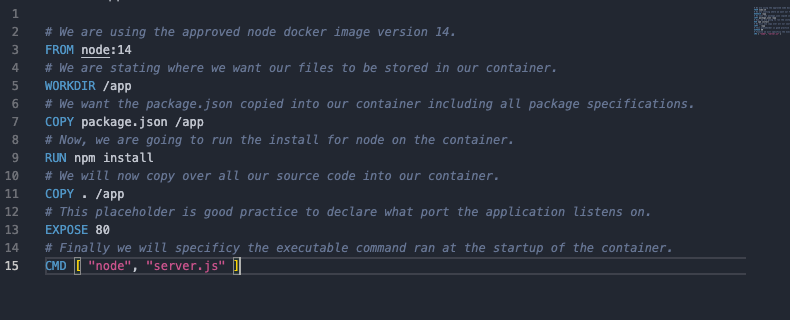
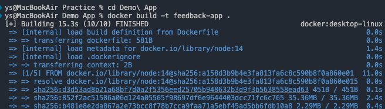
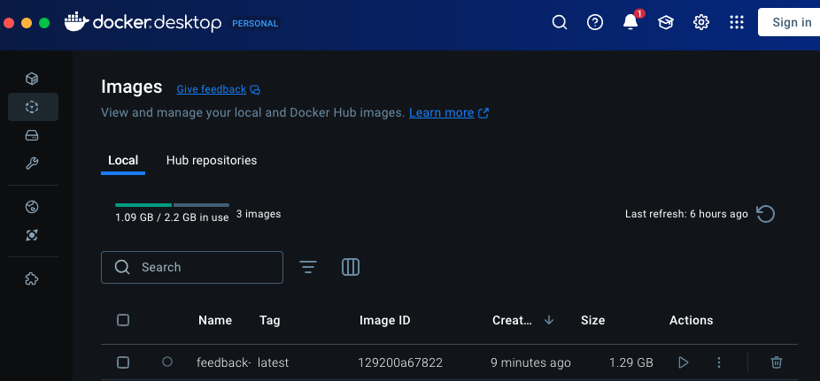
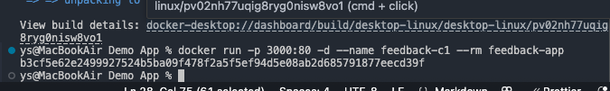
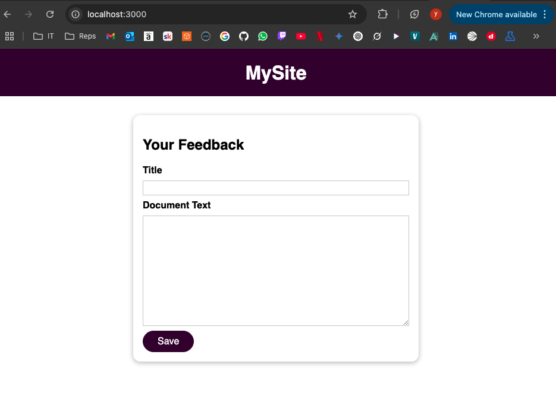
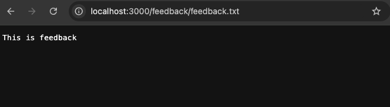

# Docker & Kubernetes: The Practical Guide - Containerizing a Node Application

This is a demo app taken from Academics Docker & Kubernetes: The Practical Guide to visualize using Docker to create an image and containerize a simple Node application.

## Creating the Dockerfile



We have a pre-configured Node application that allows users to input feedback, which is then stored and relayed back to the host. To containerize it, we create a simple Dockerfile using the node image from Docker Hub, specifying version 14 (`node:14`) to ensure consistency. Without a version, the latest tag would be pulled, which can change unexpectedly.

Next, we set the working directory inside the container with `WORKDIR /app` and copy package.json into it. The node:14 image provides Node.js but not our app's specific dependencies, so package.json lists what we need. Running `npm install` in the RUN layer installs only those dependencies, keeping the image lightweight and consistent.

Then, we copy into the container with `COPY . /app`. Docker builds images in layers, and order matters for caching. Placing stable steps (like npm install) before variable ones (like source code) speeds up builds, as dependencies change less often than code.

We add `EXPOSE 80` to document that our app listens on port 80 (this is a placeholder; to use it, map the port when running the container, e.g., `-p 80:80`). Finally, `CMD ["node", "server.js"]` defines the startup command, launching our app when the container boots. After building, we'll run the container to test the app on localhost:3000.

## Creating the image



Now, we are using the following command to build our image we configured in our Dockerfile and add a tag of feedback-app using the `-t` flag:

```bash
docker build -t feedback-app .
```

We use `.` as we are including everything in the current directory as part of the image. After some time, we will get a prompt allowing us to view our build details on the Docker app GUI. Note - this process may take a moment as it downloads dependencies and builds the layers.



## Starting a container

We can now create a container based on our image using the command:

```bash
docker run -p 3000:80 -d --name feedback-c1 --rm feedback-app
```

This maps port 3000 on our local machine to port 80 in the container, runs it in detached mode (`-d`) to free the terminal, names it with `--name`, and removes it with `--rm` when stopped.



And if we connect to our node application on localhost:3000 we'll see...



Our feedback is stored in the container's `/feedback` folder as a new file matching the title, per the server.js configuration. As there is no volume attached to our container, this is isolated from the local system and when the container shuts down,is deleted (--rm flag) and is restarted with no volume attached, files will be lost.




## Attaching a volume 

