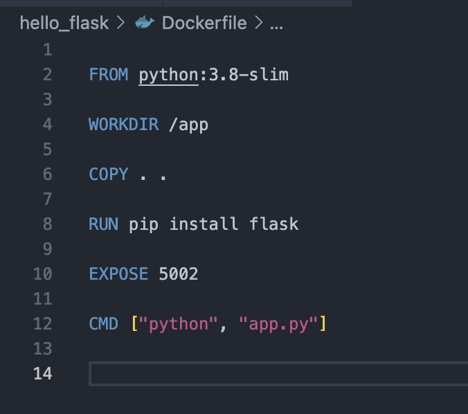
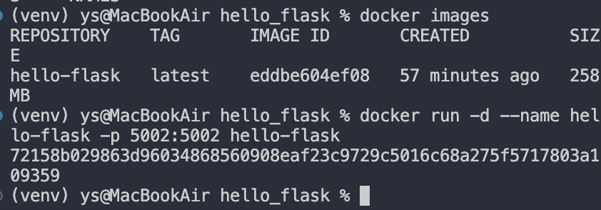
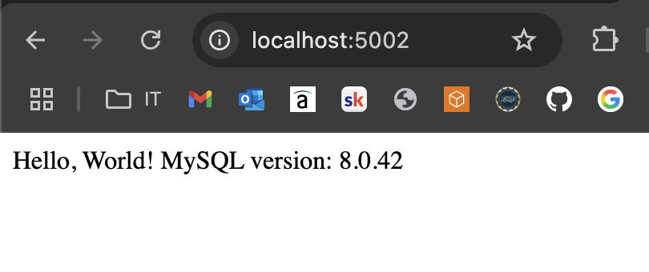
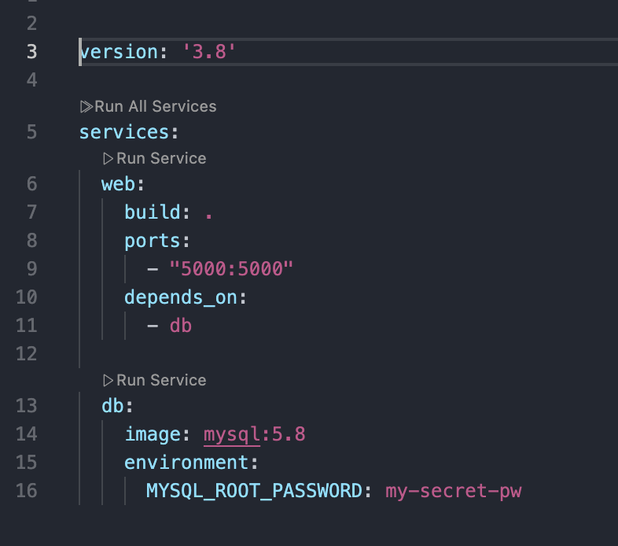

# Flask + MySQL application

## 🐳 Initializing the Dockerfile

After bringing our source code into the working directory locally, we create a `Dockerfile` with simple instructions to build our Docker image.

We:

- Choose a lightweight Python image to reduce build time (since this is a simple Flask app),
- Set the working directory inside the container,
- Copy the source code into that directory,
- Install Flask dependencies,
- Expose port `5002` for the application to listen on,
- Provide the command to run the app when the container starts.




---

## Creating an Image and Container for the Python App

With the `Dockerfile` ready, we now build the Docker image:

```bash
docker build -t hello_flask .
```

Then, create a container from the image:

```bash
docker run -d --name hello-flask -p 5002:5002 hello_flask
```

- `-d` runs the container in detached (background) mode.
- `--name` assigns a name to the container.
- `-p 5002:5002` maps the container’s port 5002 to the host’s port 5002.



---

## Creating a Network and MySQL Database Container

Docker networks allow containers to communicate by name instead of IP. To create a custom network:

```bash
docker network create my-custom-network
```

Next, we will connect the app and database to this network.

Now, to run a MySQL container:

```bash
docker run -d \
  --name mydb \
  --network my-custom-network \
  -e MYSQL_ROOT_PASSWORD=my-secret-pw \
  mysql:8.0
```

> The `MYSQL_ROOT_PASSWORD` environment variable is required for MySQL to initialize and secure root access.

We must update our Dockerfile to include `mysqlclient` in the `RUN` line above. Then rebuild the image:

```bash
docker build -t hello_flask .
```

Lastly, run the Flask container on the same network:

```bash
docker run -d --name hello-flask --network my-custom-network -p 5002:5002 hello_flask
```

Now, your Flask app can connect to the database using `mydb` as the hostname. We can now go to localhost:5002 on our browser and see our Hello World script with our MySQL version.

 

## Docker compose

To make container creation quicker and more repeatable, we use **Docker Compose** to define a reusable template for our application's services. This allows us to manage multiple containers with a single command.

In the `docker-compose.yml` file, we outline the following:

- **`version`** – the syntax version of Docker Compose  
- **`services`** – each container we want to create (e.g. `web`, `db`)  
- **`container_name`** – name for each container  
- **`image`** – which image each service uses  
- **`depends_on`** – define which containers should start first  
- **`environment`** – specify necessary environment variables like database credentials  



### ▶️ Running Docker Compose

Use the following command to bring up all defined containers in detached mode (running in the background):

```bash
docker-compose up -d
```

This gives us a reliable, repeatable and less error-prone process to build and launch the full environment for our Flask app and MySQL database with a single command.

---

