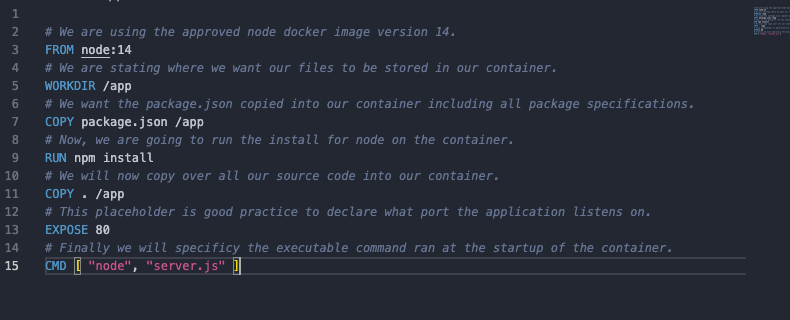
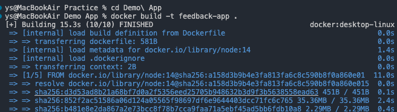
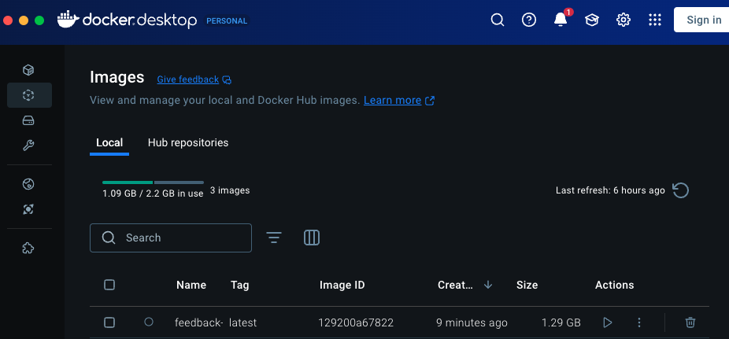
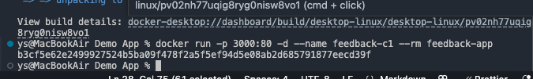
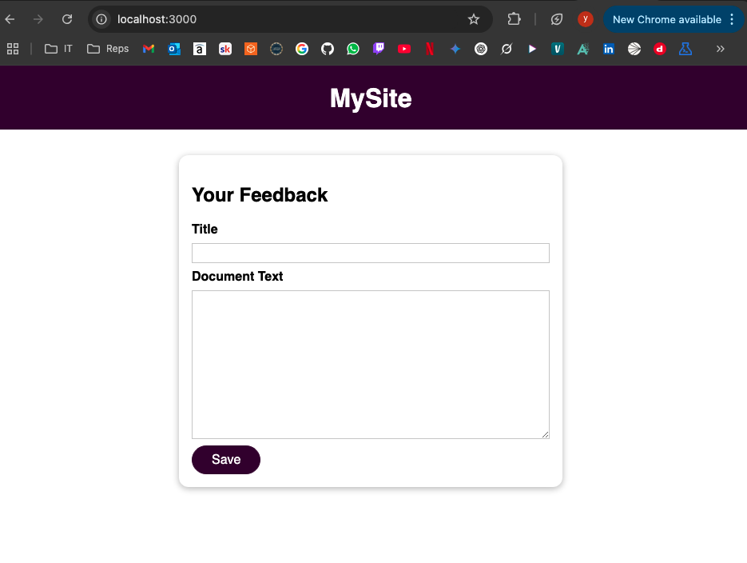
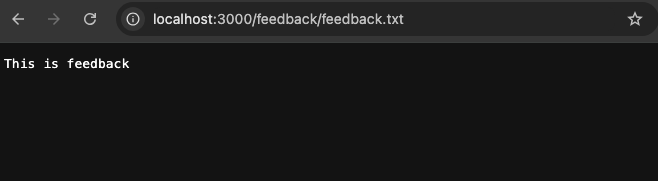
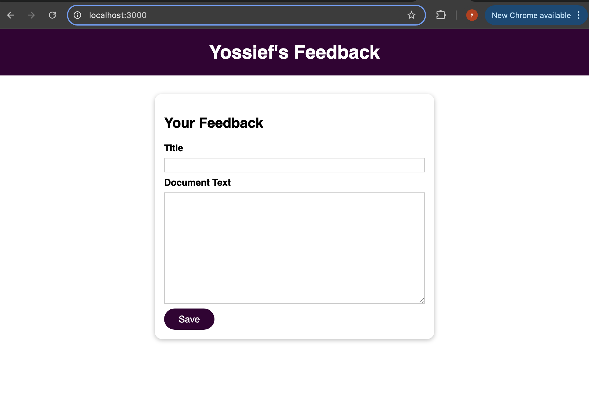

# Docker & Kubernetes: The Practical Guide - Containerizing our First Node Application


## Creating the Dockerfile



We have a pre-configured Node application that allows users to input feedback, which is then stored and relayed back to the host. To containerize it, we create a simple Dockerfile using the node image from Docker Hub, specifying version 14 (`node:14`) to ensure consistency. Without a version, the latest tag would be pulled, which can change unexpectedly.

Next, we set the working directory inside the container with `WORKDIR /app` and copy package.json into it. The node:14 image provides Node.js but not our app's specific dependencies, so package.json lists what we need. Running `npm install` in the RUN layer installs only those dependencies, keeping the image lightweight and consistent.

Then, we copy into the container with `COPY . /app`. Docker builds images in layers, and order matters for caching. Placing stable steps (like npm install) before variable ones (like source code) speeds up builds, as dependencies change less often than code.

We add `EXPOSE 80` to document that our app listens on port 80 (this is a placeholder; to use it, map the port when running the container, e.g., `-p 80:80`). Finally, `CMD ["node", "server.js"]` defines the startup command, launching our app when the container boots. After building, we'll run the container to test the app on localhost:3000.

## Creating the image



Now, we are using the following command to build our image we configured in our Dockerfile and add a tag of feedback-app using the `-t` flag:

```bash
docker build -t feedback-app .
```

We use `.` as we are including everything in the current directory as part of the image. After some time, we will get a prompt allowing us to view our build details on the Docker app GUI. Note - this process may take a moment as it downloads dependencies and builds the layers.



## Starting a container

We can now create a container based on our image using the command:

```bash
docker run -p 3000:80 -d --name feedback-c1 --rm feedback-app
```

This maps port 3000 on our local machine to port 80 in the container, runs it in detached mode (`-d`) to free the terminal, names it with `--name`, and removes it with `--rm` when stopped.



And if we connect to our node application on localhost:3000 we'll see...



Our feedback is stored in the container's `/feedback` folder as a new file matching the title, per the server.js configuration. As there is no volume attached, this data is isolated from the local system. When the container shuts down (due to the --rm flag), the feedback files are deleted. Restarting the container without a volume means all previous data will be lost.




## External storage options

Anonymous volumes are managed by Docker and are used to store data. However, we cannot directly edit their contents, and Docker assigns an unknown path on the host machine to store this data. These are useful for locking in certain data that already exists within a container and avoiding it getting overwritten. 

Named volumes persist and can be reused by name, while anonymous volumes also persist but are harder to track or reuse.

In our Node application, we can attach a named volume so that feedback data still exists after the container shuts down and we will still be able to see files saved to /feedback.

Bind mounts are managed by the user and enable reading and writing files between the container and the local system. You can specify at startup using the -v flag with an absolute path, such as `-v /absolute/path/to/folder:/targetfolder`. After the container stops and restarts, the files persist because they are stored on the host machine. This setup allows you to edit source code without needing to rebuild or recreate the container each time a change is made. Docker must have access to the file path by granting file sharing permissions.

## 🛠️ Volumes vs Bind Mounts

Using a bind mount like this:

```bash
-v $(pwd):/app
```

lets you:

- ✅ Edit your source code locally
- ✅ See changes live in the container without rebuilding
- 🚫 But it also **overwrites `/app/node_modules`**, breaking your app!

---

⚠️ Problem: `node_modules` Is Overwritten

When the whole `/app` folder is replaced by the host version (your source files), the installed dependencies (`node_modules`) from inside the container get wiped.

This often causes your app to break with "module not found" errors.

---

✅ Solution: Add a Separate Volume for `node_modules`

To avoid this, we **mount a separate Docker-managed volume just for `node_modules`**:

```bash
docker run \
  -v $(pwd):/app \
  -v /app/node_modules \
  my-node-app
```

### 🔍 Breakdown:
- `-v $(pwd):/app` → Bind mount your source code folder
- `-v /app/node_modules` → Anonymous volume that preserves the container’s dependencies

---

## 🧪 Example: Editing Source Code Live

After setting up the container correctly, I changed the following line in my HTML:

```html
<title>Mysite</title>
```

to:

```html
<title>Yossief's Feedback</title>
```



✅ The change was instantly visible in the browser without restarting or rebuilding the container!


