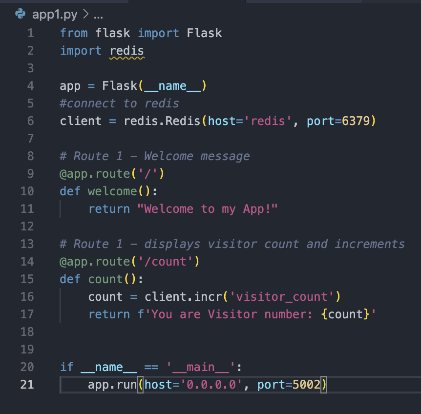
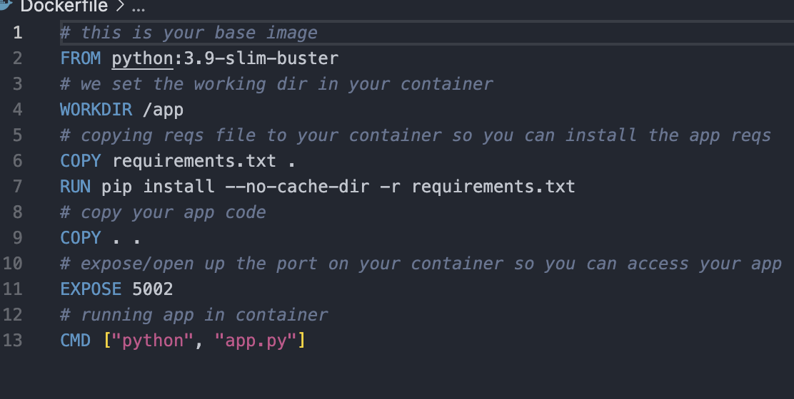
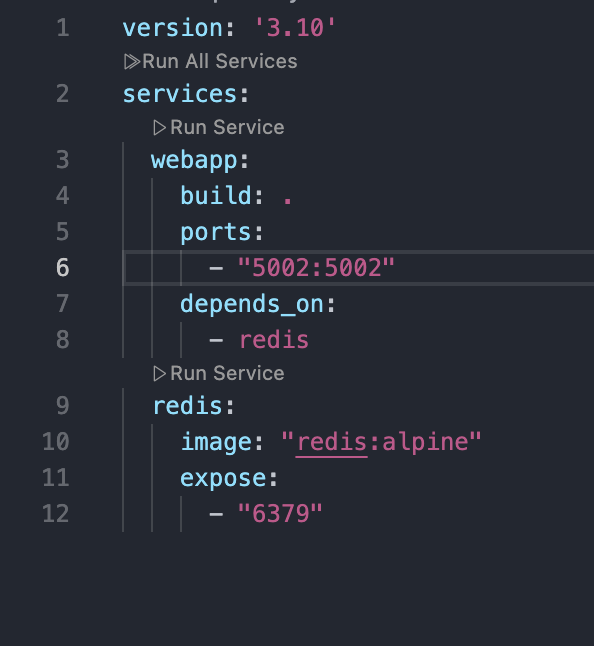
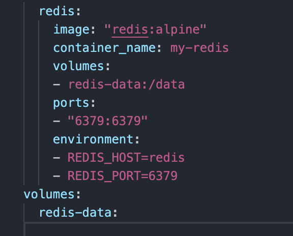
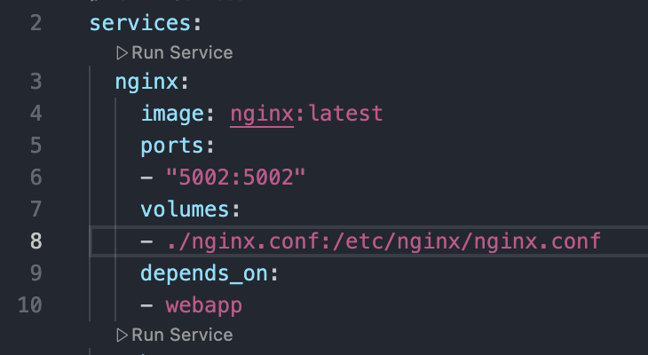

# 🐋 Dockerized Visitor Counter | Flask + Redis + Nginx

This straightforward web application demonstrates container orchestration with Docker and Docker Compose, featuring three services:

Nginx: Acts as a load balancer and reverse proxy.
Flask: Manages backend request handling.
Redis: Handles storage and tracking of visit counts.

Each service operates in its own Docker container and communicates via a Docker network.

## Step 1 - Project set-up

Flask will be our web server using two routes: /, a welcome page and /count, displaying the visitor count increasingly. We create a redis client that connects to redis server with the host set to our service name in our compose file and port is set to the default Redis port. We also have our requirements file in our working directory to list all dependencies.

The Dockerfile will define the environment and instruct on how to set up and run the app. We use a slim base image to keep our simple app lightweight, copy requirements into our container and install all dependencies.

## Step 2 - Using Docker Compose

Docker compose allows us to run multi container applications within the same network, allowing them to work together simultaneously. 

We use `docker-compose up --build` to build our Docker image for the application, then start both containers with the flask container depending on the redis container. This ensures that the flask application does not start without being connected to the database first.

## Step 3 - Improvements to our application

As data inside the container is destroyed when it stops or is deleted, we'll retain our data using volumes. I have updated the docker-compose.yaml to include a volume reids-data:/data, with our data now being stored in a docker managed folder in our host machine and in the /data folder in the container. 

Also, we have configured our application to read our connection details from environment variables. is to protect app.py from being edited by keeping the Redis connection details in docker-compose.yml (or a .env file). This way, others can tweak the values there without risking mistakes or "butchering" the code, making it safer and easier to maintain.

Last, I added an NGINX server to my application to act as a load balancer, distributing traffic to handle more end users accessing my site. I included an NGINX block in my docker-compose.yml file, using the nginx:latest image. This setup listens on the host machine (e.g., port 5002) and mounts a custom nginx.conf file. Docker's internal DNS automatically resolves the service names (like webapp) and directs traffic to the appropriate containers.

To scale the application and run multiple instances, I rebuilt the services with the command `docker-compose up --scale webapp=3`. This creates three webapp containers, and NGINX load balances traffic across them for better performance and reliability.

## Final Product

