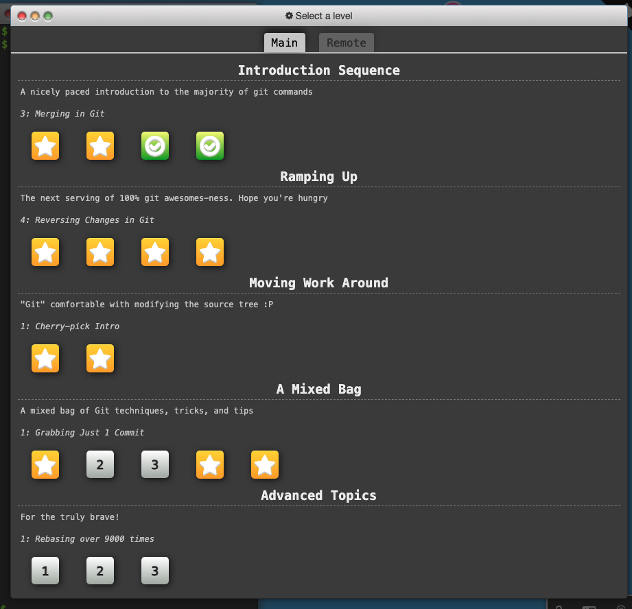

# Learn Git Branching – First 8 Levels Summary
A fun, visual way to actually understand Git — not just memorize commands.

### 🌱 Level 1: Introduction to Git Commits
Goal: Learn the basics of creating commits and seeing your commit history.

You start off in a simple repo. You’ll run:

``git commit``

...to create snapshots of your work. It teaches that each commit is like a "save point" in your project’s history. You also get your first look at the commit graph and how each commit points to the one before it.

### 🔍 Level 2: Branching in Git
Goal: Understand how branches work and how to create them.

This level shows how branching lets you work on new features without touching the main code. You see how branches point to commits, and how HEAD tracks where you are.

``git branch <branch-name>``
``git checkout <branch-name>``

### 🔀 Level 3: Merging and Rebasing
Goal: Learn how to combine work from different branches.

Now that you have branches, you’ll want to bring them back together. This level introduces:

``git merge``

You’ll see how merging creates a new commit that ties branches together — and also get a peek at the cleaner alternative:

``git rebase``
This helps you keep history tidy.

### 📍 Level 4: Moving Work Around
Goal: Start navigating Git like a pro — jumping between commits and branches.

Here you learn to move the HEAD and branches manually using:

``git checkout``
``git reset``

You explore how to go back in time, switch between workspaces, and understand what “detached HEAD” means. It’s all about building intuition for Git’s structure.

### 🧠 Level 5: Detach Yo' HEAD
Goal: Understand what a “detached HEAD” is and how to work with it.

Normally, HEAD points to the latest commit on your current branch. But sometimes you want to explore or test something from the past without messing up your branches.

You’ll try:

``git checkout <commit-hash>``

This puts you in a detached HEAD state, meaning you're no longer on a branch — just looking at a specific commit. Great for inspecting history or testing without leaving a trace.

### 🔗 Level 6: Relative References
Goal: Learn Git's powerful shorthand for navigating commits.

Instead of typing full commit hashes, you can move around using symbols like:

HEAD^ → parent commit

HEAD^^ → grandparent

HEAD~3 → 3 commits back

Example:

``git checkout HEAD~2``

This makes working with history way faster — no need to copy/paste hashes.

### 🔁 Level 7: Relative References 2
Goal: Practice combining relative refs with branch names.

Now you're combining everything: use shorthand like main~2 or bugfix^ to refer to commits on other branches.

Example:

``git checkout feature~1``
This is super useful when reviewing someone else’s branch or cherry-picking a specific commit.

### ⏪ Level 8: Reversing Changes in Git
Goal: Learn how to undo changes the right way — without fear.

This level introduces two core commands:

git revert → safely undo a commit by creating a new one that cancels it out.

git reset → move your branch pointer backward (can be dangerous if used carelessly).

Examples:

``git revert HEAD``        # creates a new commit that undoes the last one  
``git reset HEAD~1``       # moves the branch pointer back one commit

It’s about learning how to fix mistakes — the Git way.

