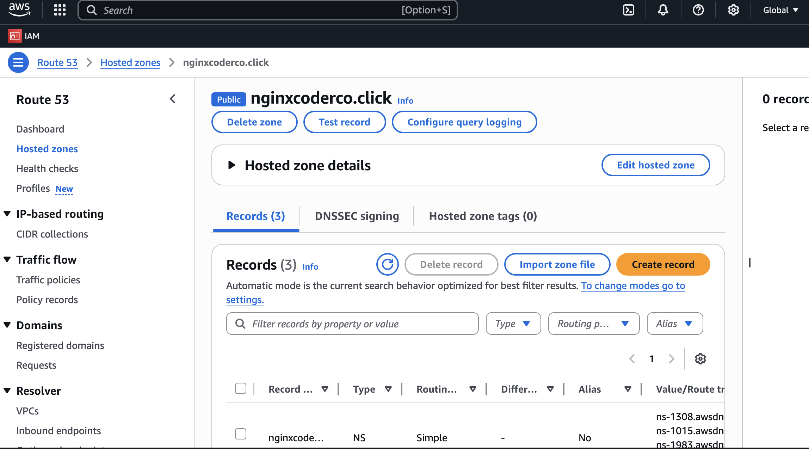
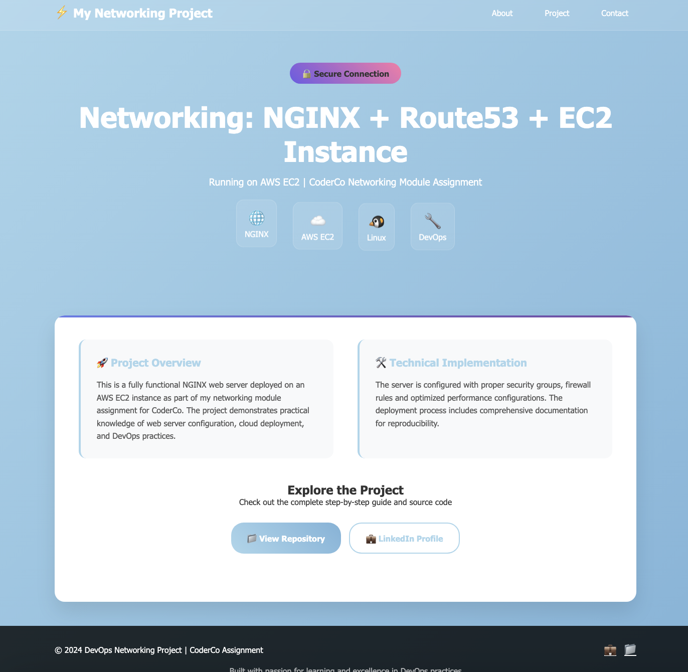

# 🌐 NGINX Website on AWS EC2: nginxcoderco.click

This README documents the setup of a website hosted on an AWS EC2 instance running NGINX, accessible at new.nginxcoderco.click.

## Prerequisites

- AWS account (within Free Tier for no EC2/EBS charges)
- Domain (nginxcoderco.click) registered via Route 53, Cloudflare or another registrar.

## Setup Steps

### Purchase Domain:

Register nginxcoderco.click via Cloudflare or Route 53 (around $3 a year for the .click domain different domains vary in price).
Set nameservers to Cloudflare or use Route 53’s hosted zone.


## Launch EC2 Instance:

- In AWS Console: EC2 > Instances > Launch Instances.
- AMI: Amazon Linux 2
- Instance Type: t2.micro 
- Enable Auto-assign Public IP.
- Storage: 8 GB gp2 SSD.
- Security Group: Allow HTTP (port 80, 0.0.0.0/0) and SSH (port 22, your IP).
- Key Pair: Download (e.g., nginx-key.pem).


## Assign Elastic IP:

EC2 > Elastic IPs > Allocate > Associate with instance.

Ensures static IP for DNS (Free Tier when attached).


## Install NGINX:

SSH: 

```bash
ssh -i nginx-key.pem ec2-user@<EC2-Public-IP>
```

### Amazon Linux:

```bash
sudo yum update -y && sudo yum install nginx -y
```
```bash
sudo systemctl start nginx && sudo systemctl enable nginx
```


## Configure DNS:

Add A records (Cloudflare or Route 53):
- Name: new, Value: <Elastic-IP>, Type: A.



Result: ```new.nginxcoderco.click```
Verify: ```dig nginxcoderco.click```


## Configure NGINX:

File: /etc/nginx/conf.d/nginxcoderco.click.conf 

```bash 

Content:server 
{

    listen 80;
    server_name nginxcoderco.click new.nginxcoderco.click;
    root /usr/share/nginx/html;
    index index.html;
    location / 
    {
        try_files $uri $uri/ /index.html;
    }
}

```

Test and reload:

```bash 
sudo nginx -t && sudo systemctl reload nginx
```

## Test Website:

Visit new.nginxcoderco.click



Troubleshoot:

- Check NGINX: sudo systemctl status nginx.
- Verify security group and DNS.
- Ensure files are in /usr/share/nginx/html

As a project extension we can add a SSL certificate so our site can be accessed through https://


## Avoid Charges:

- Use one t2.micro instance.
- Keep Elastic IP attached.
- Monitor usage in AWS Billing Dashboard.
- Stop instance when not needed (saves Free Tier hours).


